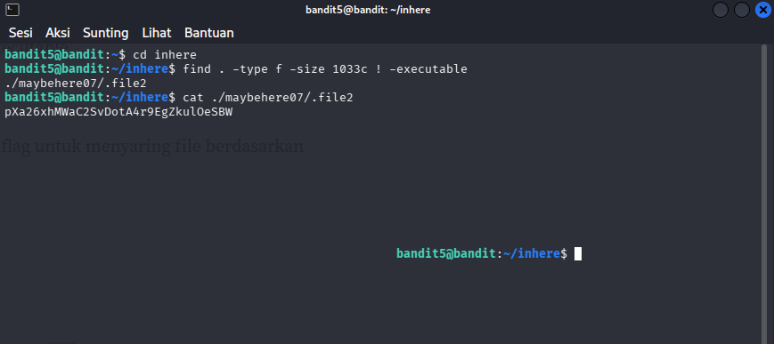

# OverTheWire : Level 5 - 6

## Objectives
Mencari password yang terdapat dalam direktori "inhere", kita harus menggunakan command "find" karena file tersebut berukuran 1033 bytes, human-readable, dan tidak executable

## Purpose
Memahami dan menggunakan command "find" untuk mencari file dengan kriteria tertentu

## Solution
```bash
# Login sebagai bandit5
ssh bandit5@bandit.labs.overthewire.org -p 2220
```

```bash
# masuk ke direktori inhere
cd inhere

# cari file dengan size 1033 bytes dan tidak excecutable
find . -type f -size 1033c ! -executable

# membaca file hasil pencarian
cat ./maybehere07/.file2
```



**Penjelasan :** Command "find" berfungsi untuk mencari file berdasarkan kondisi tertentu, -size 1033c untuk file yang berukuran 1033c dan ! -executable untuk file yang tidak executable

**Password :** pXa26xhMWaC2SvDotA4r9EgZkulOeSBW

## Conclusion 
Di level ini kita mencari password yang ada di dalam file berukuran 1033 bytes dan tidak executable. Kita bisa mencarinya dengan command find
