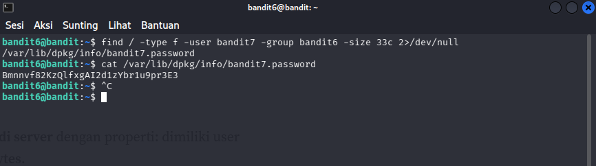

# OverTheWire : Level 6-7

## Objectives
Mencari password untuk level selanjutnya di dalam file server yang dimiliki oleh user bandit7, group bandit6, ukuran 33 bytes

## Purpose
Memahami dan menggunakan command "find" untuk mencari file dalam kondisi tertentu

## Solution
```bash
# Login sebagai bandit6
ssh bandit6@bandit.labs.overthewire.org -p 2220
```

```bash
# cari dari root, berdasarkan ukuran, type, user dan group
find / -type f -user bandit7 -group bandit6 -size 33c 2>/dev/null

# Membaca file yang ditemukan
 cat /var/lib/dpkg/info/bandit7.password
```



**Penjelasan :** 2>/dev/null berfungsi untuk membuang semua pesan error "Permission denied" agar output bersih dan hanya menampilkan file yang berhasil ditemukan.

**Password :** Bmnnvf82KzQlfxgAI2d1zYbr1u9pr3E3


