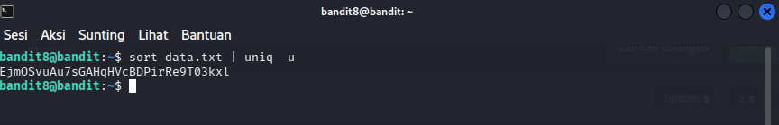

# OverTheWire : Level 8 - 9

## Objectives 
Mencari password di dalam file "data.txt". Password itu hanya ada 1 dan kita diminta untuk sort data dan memfilter data yang hanya muncul sekali

## Purpose
Mempelajari dan menggunakan command "sort" untuk mengurutkan data dan "uniq' untuk mencari data yang hanya muncul sekali

## Solution 
```bash
# Masuk ke bandit8
ssh bandit8@bandit.labs.overthewire.org -p 2220
```

```bash
# Mengurutkan data dan mencari data yang hanya muncul sekali
sort data.txt | uniq -u
```



**Penjelasan :** command "sort" berfungsi untuk mengurutkan data yang duplikat dan command "uniq -u" untuk mencari data yang hanya ada satu

**Password :** EjmOSvuAu7sGAHqHVcBDPirRe9T03kxl

