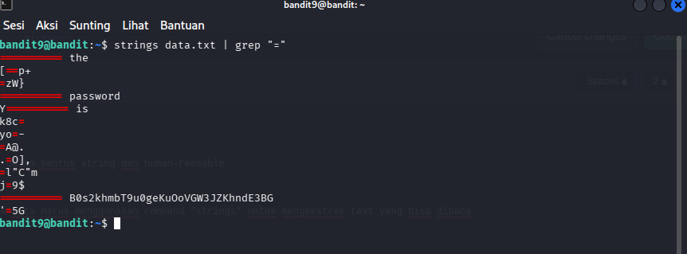

# OverTheWire : Level 9 - 10

## Objectives
Mencari password yang tersimpan dalam file "data.txt" diantara karakter "=", dalam bentuk string dan human-readable

## Purpose
File data.txt adalah file binary, jadi untuk mencari file yang human-readable kita harus menggunakan command "strings" untuk mengekstrak text yang bisa dibaca

## Solutios
```bash
# Login sebagai bandit9
ssh bandit9@bandit.labs.overthewire.org -p 2220
```

```bash
# Ekstrak string readable dan filter yang mengandung '='
strings data.txt | grep "="
```



**Penjelasan :** Command "strings" berfungsi untuk mengekstrak tulisan yang bisa dibaca oleh manusia, dan command "grep" untuk mencari data yang mengandung "="

